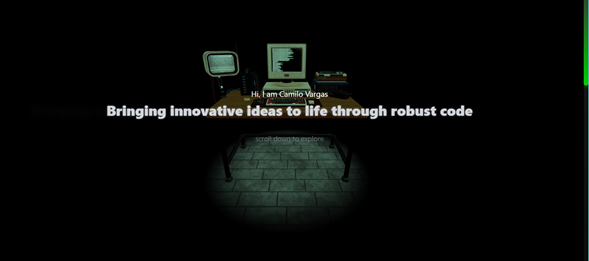
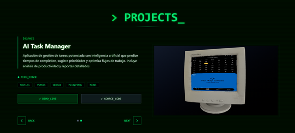
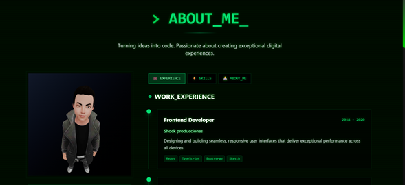
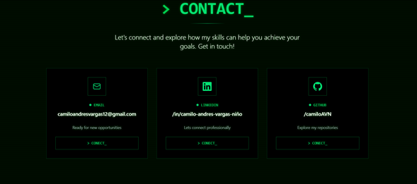

# 🚀 Personal Portfolio

<div align="center">
  
  
  
  
  

</div>

<div align="center">
  <h3>✨ Interactive 3D Portfolio built with React, Three.js, and modern web technologies ✨</h3>
</div>

---

## 📸 Preview

<div align="center">

### 🏠 Home Section
<br>
*Interactive 3D hero section with dynamic animations*

### 💼 Projects Section  
<br>
*Showcase of featured projects with smooth transitions*

### 🎯 Skills Section
<br>
*3D visualization of technical skills and expertise*

### 📞 Contact Section
<br>
*Interactive contact form with 3D elements*

</div>

---

## 🛠️ Built With

<div align="center">

### Core Technologies


### Styling & UI


### 3D Graphics & Animation


### Routing


</div>

## ✨ Features

- 🎨 **Interactive 3D Elements** - Immersive 3D graphics powered by Three.js
- 🚀 **Smooth Animations** - Advanced animations using GSAP
- 📱 **Fully Responsive** - Optimized for all device sizes
- ⚡ **Fast Performance** - Built with Vite for lightning-fast development
- 🎯 **Modern Design** - Clean and professional UI with Tailwind CSS
- 🔄 **Smooth Navigation** - Seamless routing with React Router DOM
- 🌟 **Interactive Components** - Engaging user interactions throughout
- ♿ **Accessible** - Built with accessibility best practices

## 🚀 Quick Start

### Prerequisites

Make sure you have the following installed:
- **Node.js** (v16 or higher)
- **Yarn** package manager

### Installation

1. **Clone the repository**
   ```bash
   git clone https://github.com/camiloAVN/portfolio-camilo-vargas.git
   cd your-portfolio
   ```

2. **Install dependencies**
   ```bash
   yarn install
   ```

3. **Start the development server**
   ```bash
   yarn dev
   ```

4. **Open your browser**
   ```
   Navigate to http://localhost:5173
   ```

### 🔧 Available Scripts

```bash
# Start development server
yarn dev

# Build for production
yarn build

# Preview production build
yarn preview

# Lint code
yarn lint

# Format code
yarn format
```

## 📦 Dependencies

### Main Dependencies
```json
{
  "react": "^19.1.0",
  "react-dom": "^19.1.0",
  "react-router-dom": "^7.7.1",
  "three": "^0.179.1",
  "@react-three/fiber": "^9.3.0",
  "@react-three/drei": "^10.6.1",
  "gsap": "^3.13.0"
}
```

### Development Dependencies
```json
{
  "@vitejs/plugin-react": "^4.6.0",
  "vite": "^7.0.4",
  "tailwindcss": "^4.1.11",
}
```

## 📁 Project Structure

```
portfolio/
├── public/
│   ├── favicon.ico
│   └── index.html
├── src/
│   ├── assets/
│   │   ├── images/
│   │   ├── models/
│   │   ├── textures/
│   ├── components/
│   │   ├── AboutMe.jsx
│   │   ├── Avatar.jsx
│   │   ├── CanvasLoader.jsx
│   │   ├── DemoPc.jsx
│   │   ├── OldPc.jsx
│   │   ├── Projects
│   │   ├── RetroCodeBackground.jsx
│   │   └── RetroTerminalScreen.jsx
│   ├── pages/
│   │   ├── PortafolioPage.jsx
│   │   └──ProjectsPortfolioPage.jsx
│   ├── hooks/
│   ├── utils/
│   ├── styles/
│   ├── App.jsx
│   └── main.jsx
├── package.json
├── vite.config.js
├── tailwind.config.js
└── README.md
```

## ⚙️ Configuration

### Tailwind Configuration
```javascript
// tailwind.config.js
import { defineConfig } from 'vite'
import react from '@vitejs/plugin-react'
import tailwindcss from '@tailwindcss/vite'

// https://vite.dev/config/
export default defineConfig({
  plugins: [
    react(),
    tailwindcss()

  ],
})

```

## 🎨 Key Technologies Explained

### 🎭 Three.js & React Three Fiber
- **Three.js**: JavaScript 3D library for creating and displaying 3D graphics
- **React Three Fiber**: React renderer for Three.js, making 3D development more React-like
- **Drei**: Useful helpers and abstractions for React Three Fiber

### 🎬 GSAP (GreenSock Animation Platform)
- High-performance animations with timeline control
- Smooth scroll-triggered animations
- Complex motion paths and morphing

### 🎨 Tailwind CSS
- Utility-first CSS framework
- Responsive design system
- Custom design tokens and themes

### 🧭 React Router DOM
- Client-side routing
- Smooth page transitions
- Dynamic route handling

## 📱 Responsive Design

The portfolio is fully responsive and optimized for:
- 📱 **Mobile devices** (320px and up)
- 📟 **Tablets** (768px and up)  
- 💻 **Desktops** (1024px and up)
- 🖥️ **Large screens** (1440px and up)

## 🌟 Performance Optimizations

- ⚡ **Vite bundling** for fast builds
- 🎯 **Code splitting** with lazy loading
- 🖼️ **Image optimization** and lazy loading
- 🎮 **3D model optimization** for web
- 📦 **Bundle size optimization**

## 📄 License

This project is licensed under the MIT License - see the [LICENSE](LICENSE) file for details.

## 🙏 Acknowledgments

- [Three.js](https://threejs.org/) - 3D graphics library
- [React Three Fiber](https://docs.pmnd.rs/react-three-fiber) - React renderer for Three.js
- [GSAP](https://greensock.com/gsap/) - Animation library
- [Tailwind CSS](https://tailwindcss.com/) - CSS framework
- [Vite](https://vitejs.dev/) - Build tool

---

<div align="center">

**⭐ If you found this project helpful, please give it a star! ⭐**

[](https://yourportfolio.com)

Made with ❤️ and lots of ☕

</div>


# React + Vite

This template provides a minimal setup to get React working in Vite with HMR and some ESLint rules.

Currently, two official plugins are available:

- [@vitejs/plugin-react](https://github.com/vitejs/vite-plugin-react/blob/main/packages/plugin-react) uses [Babel](https://babeljs.io/) for Fast Refresh
- [@vitejs/plugin-react-swc](https://github.com/vitejs/vite-plugin-react/blob/main/packages/plugin-react-swc) uses [SWC](https://swc.rs/) for Fast Refresh

## Expanding the ESLint configuration

If you are developing a production application, we recommend using TypeScript with type-aware lint rules enabled. Check out the [TS template](https://github.com/vitejs/vite/tree/main/packages/create-vite/template-react-ts) for information on how to integrate TypeScript and [`typescript-eslint`](https://typescript-eslint.io) in your project.
